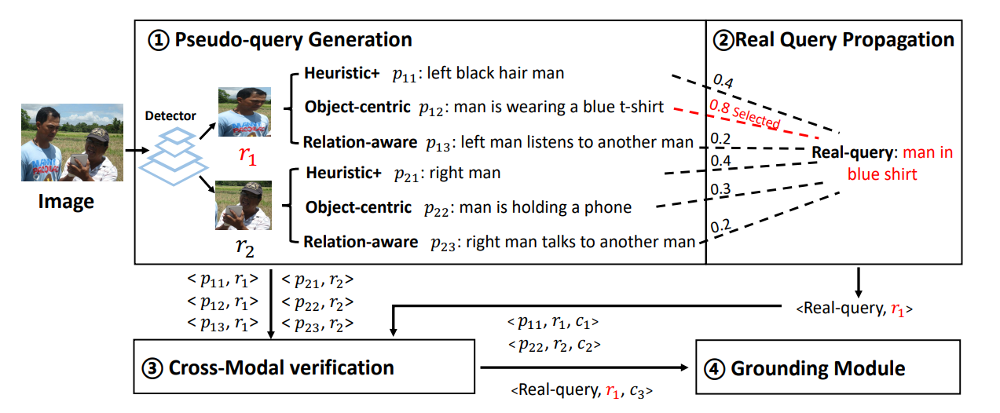

# CPL
<p align="center">  </p>

This repository is the official Pytorch implementation for ICCV2023 paper **Confidence-aware Pseudo-label Learning for Weakly Supervised Visual Grounding**.

**Please leave a <font color='orange'>STAR ⭐</font> if you like this project!**

## Contents

1. [Usage](#usage)
2. [Results](#results)
3. [Contacts](#contacts)
4. [Acknowledgments](#acknowledgments)

- Python 3.9.10
- PyTorch 1.9.0 + cu111 + cp39
- [Pytorch-Bert 0.6.2](https://pypi.org/project/pytorch-pretrained-bert/)
- Check [requirements.txt](requirements.txt) for other dependencies. 

### Data Preparation
1.You can download the images from the original source and place them in `./data/image_data` folder:
- RefCOCO and ReferItGame
- [Flickr30K Entities](http://shannon.cs.illinois.edu/DenotationGraph/#:~:text=make%20face-,Downloads,-Please%20fill%20in)

Finally, the `./data/` and `./image_data/` folder will have the following structure:

```angular2html
|-- data
      |-- flickr
      |-- gref
      |-- gref_umd
      |-- referit
      |-- unc
      |-- unc+
|-- image_data
   |-- Flickr30k
      |-- flickr30k-images
   |-- other
      |-- images
   |-- referit
      |-- images
```
- ```./data/```: Take the Flickr30K dataset as an example, ./data/flickr/ shoud contain files about the dataset's train/validation/test annotations (download from XXXX) and our generated pseudo-samples for this dataset . You should uncompress the provided files and put them on the corresponding folder.
- ```./image_data/Flickr30k/flickr30k-images/```: Image data for the Flickr30K dataset, please download from this [link](http://shannon.cs.illinois.edu/DenotationGraph/#:~:text=make%20face-,Downloads,-Please%20fill%20in). Fill the form and download the images.
- ```./image_data/other/images/```: Image data for RefCOCO/RefCOCO+/RefCOCOg. 
- ```./image_data/referit/images/```: Image data for ReferItGame.

2. The generated pseudo region-query pairs can be download from [XXXX](XXX) or you can generate pseudo samples follow [instructions](./pseudo_sample_generation/README.md).

Note that to train the model with pseudo samples for different dataset you should put the uncompressed pseudo sample files under the right folder ```./data/xxx/```. For example, put the ```fickr_train_cross_modal.pth``` under ```./data/flickr/```.

For generating pseudo-samples, we adopt the pretrained detector and attribute classifier from the [VinVL]. The pytorch implementation of this paper is available at [VinVL](https://github.com/microsoft/scene_graph_benchmark).
